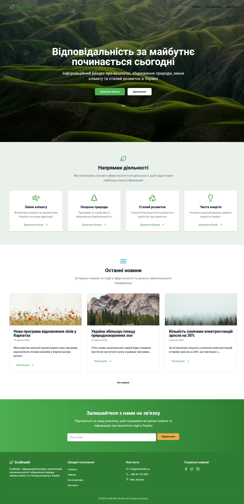
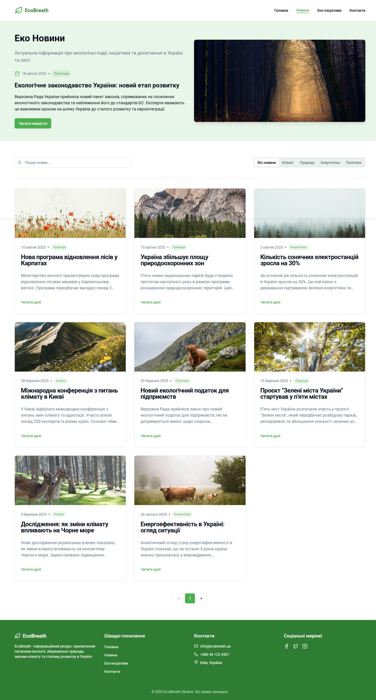
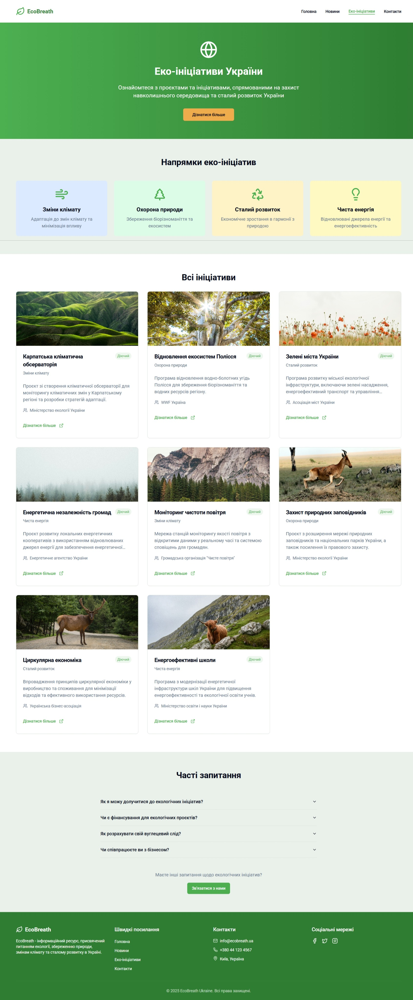
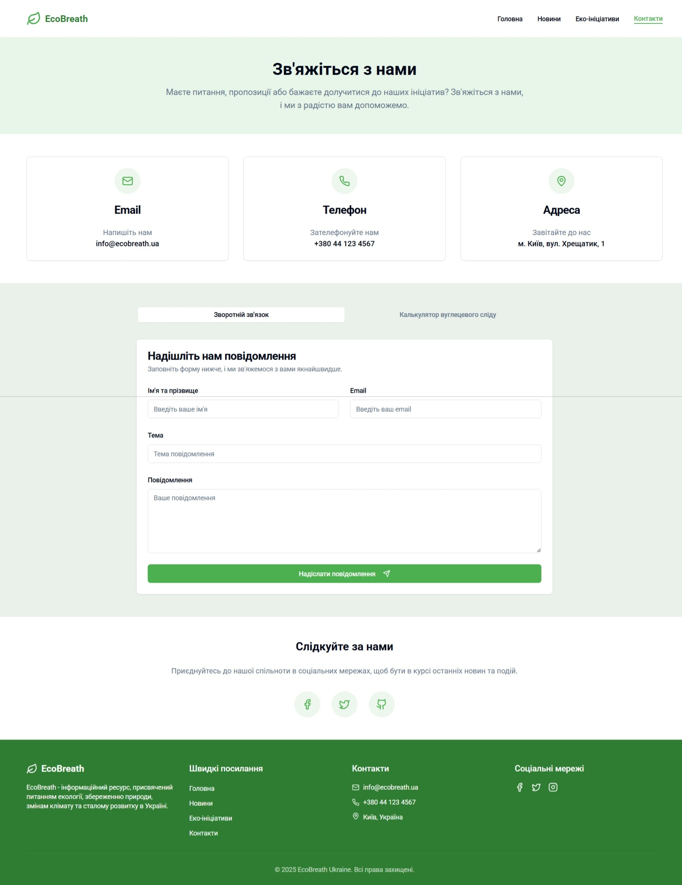
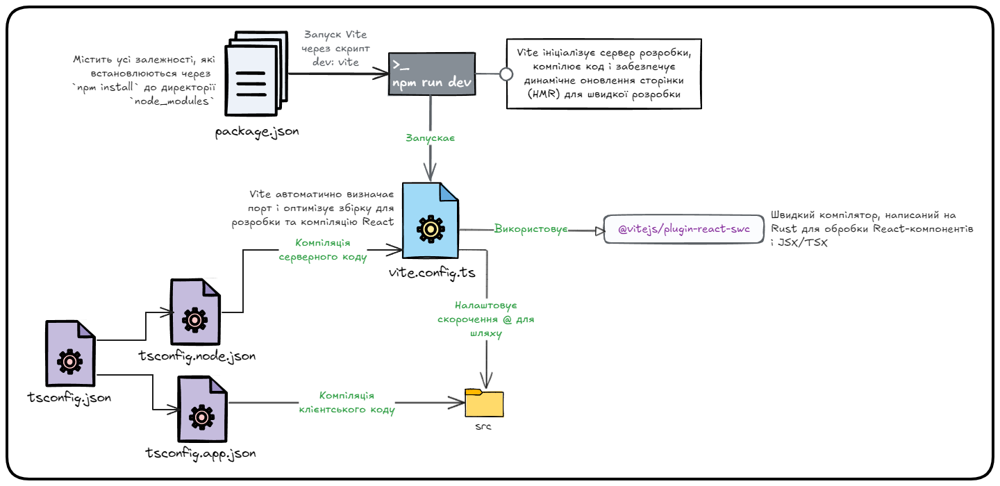
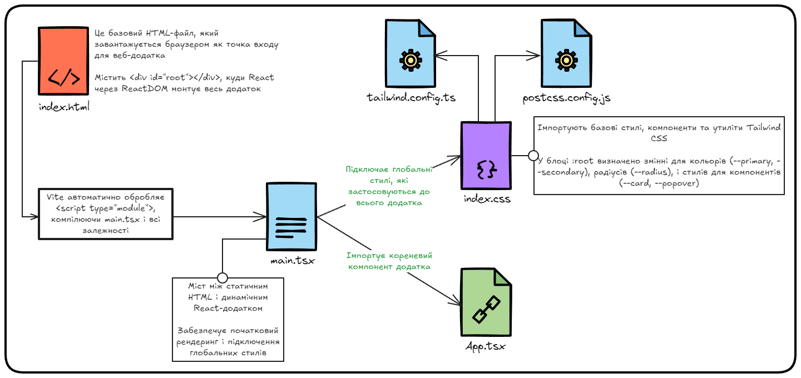
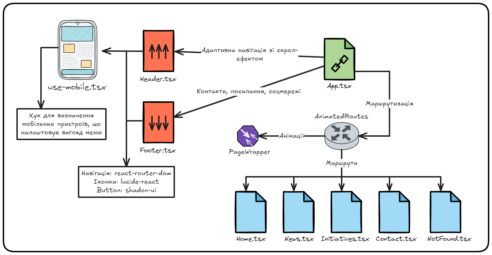
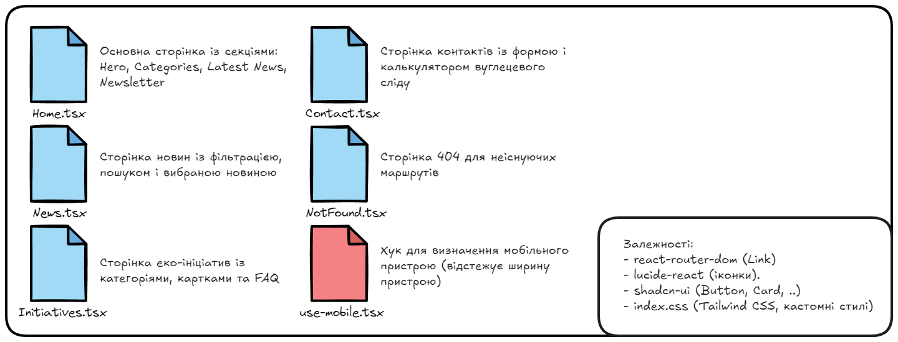
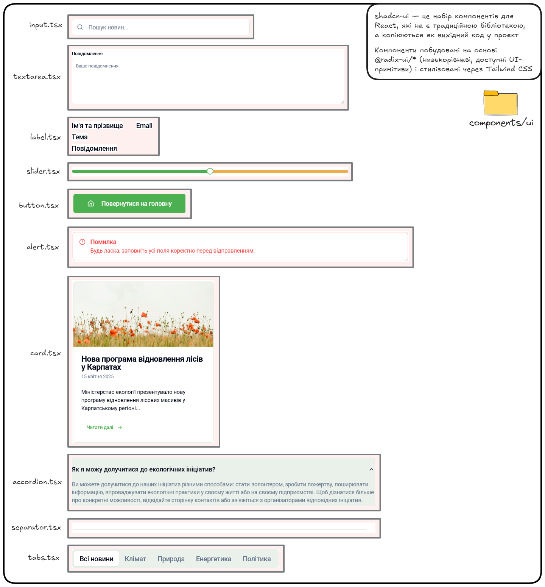

# EcoBreath Ukraine

EcoBreath Ukraine is an informational web platform dedicated to environmental issues, nature conservation, climate change, and sustainable development in Ukraine. The project aims to raise awareness, provide up-to-date news, showcase eco-initiatives, and engage users through interactive features like a carbon footprint calculator and a contact form.

This repository contains the source code for the EcoBreath Ukraine website, built as a modern single-page application (SPA) using React and a variety of frontend technologies.

## Table of Contents

- Features
- Screenshots
- Architecture
- Technologies
- Installation
- Usage
- Project Structure
- Contributing
- License

## Features

- **Homepage**: Engaging hero section, categorized content, recent news, and a newsletter subscription form.
- **News Page**: Filterable and searchable news articles with expandable content.
- **Initiatives Page**: Showcases eco-initiatives with category filtering and an FAQ accordion.
- **Contact Page**: Contact form and an interactive carbon footprint calculator.
- **404 Page**: Custom page for handling non-existent routes with error logging.
- **Responsive Design**: Fully adaptive layout for desktop and mobile devices.
- **Animations**: Smooth page transitions using Framer Motion.
- **Accessibility**: Built with accessible components from `@radix-ui/*`.
- **Notifications**: Toast notifications for user interactions (e.g., form submissions).

## Screenshots

Below are screenshots of key pages in the EcoBreath Ukraine website:

### Homepage



### News Page



### Initiatives Page



### Contact Page



## Architecture (Schemes in UA)

The EcoBreath Ukraine project follows a modular architecture, with a clear separation of concerns between components, pages, hooks, and styles. Below are diagrams illustrating the project's structure and data flow, created using Excalidraw.

### Initialising the project



### Entry point to the client code



### Main component of the application



### Pages and their functionality



### Shadcn-ui components and libraries



## Technologies

The project leverages modern frontend technologies for a robust and maintainable codebase. Below is a list of key technologies:

- **React**: JavaScript library for building user interfaces.
- **TypeScript**: Adds static types to JavaScript for improved developer experience.
- **Vite**: Fast build tool and development server.
- **React Router**: Client-side routing for navigating between pages.
- **Framer Motion**: Library for animations and transitions.
- **Tanstack Query**: Data fetching and state management for asynchronous operations.
- **shadcn-ui**: Reusable UI components built on `@radix-ui/*` and styled with Tailwind CSS.
- **Radix UI**: Accessible, low-level UI primitives.
- **Tailwind CSS**: Utility-first CSS framework for styling.
- **Lucide React**: Icon library for consistent and customizable icons.
- **React Hook Form**: Performant form management (used in `form.tsx`).
- **Zod**: Schema validation for forms (used with `react-hook-form`).

## Installation

To set up the project locally, follow these steps:

1. **Clone the repository**:

   ```bash
   git clone https://github.com/your-username/eco-breath-ukraine.git
   cd eco-breath-ukraine
   ```

2. **Install dependencies**: Ensure you have Node.js installed. Then run:

   ```bash
   npm install
   ```

3. **Run the development server**:

   ```bash
   npm run dev
   ```

## Usage

Once the development server is running, you can access the website at `http://localhost:5173`. The website includes the following pages:

- **Home** (`/`): Learn about the project, explore categories, view recent news, and subscribe to the newsletter.
- **News** (`/news`): Browse, filter, and search environmental news articles.
- **Initiatives** (`/initiatives`): Discover eco-initiatives with category filtering and FAQs.
- **Contact** (`/contact`): Submit inquiries via the contact form or calculate your carbon footprint.
- **404 Page** (`/*`): Handles invalid routes with a user-friendly error message.

### Example Interactions

- **Subscribe to Newsletter** (Home page): Enter your email in the newsletter form and submit to receive a confirmation alert.
- **Filter News** (News page): Use the search bar or category tabs to find specific articles. Click "Читати далі" to expand an article.
- **Explore Initiatives** (Initiatives page): Filter initiatives by category (e.g., "Чиста енергія") or view FAQs in the accordion.
- **Contact Form** (Contact page): Fill out the form and submit to see a success notification. Use the carbon footprint calculator to estimate your environmental impact.

## Contributing

Contributions are welcome! To contribute:

1. Fork the repository.
2. Create a feature branch (`git checkout -b feature/your-feature`).
3. Commit your changes (`git commit -m "Add your feature"`).
4. Push to the branch (`git push origin feature/your-feature`).
5. Open a pull request.

Please ensure your code follows the project's coding standards and includes appropriate tests.

## License

This project is licensed under the MIT License. See the LICENSE file for details.

---

*EcoBreath Ukraine* is a project aimed at fostering environmental awareness and sustainable development. Join us in making a positive impact! 🌿